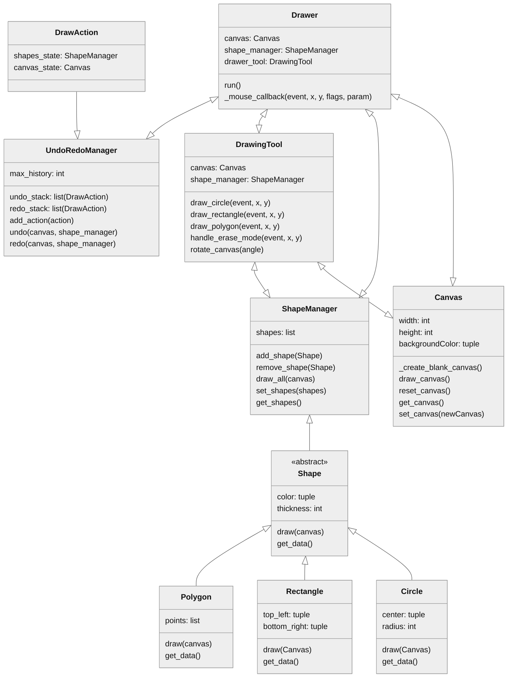

#

```mermaid
    %%{init: {'theme': 'neutral', 'themeVariables': {'primaryColor': '#4CAF50', 'edgeLabelBackground': '#ffffff'}}}%%


    classDiagram
        class Canvas {
            width: int
            height: int
            backgroundColor: tuple
            _create_blank_canvas()
            draw_canvas()
            reset_canvas()
            get_canvas()
            set_canvas(newCanvas)
        }

        class ShapeManager {
            shapes: list
            add_shape(Shape)
            remove_shape(Shape)
            draw_all(canvas)
            set_shapes(shapes)
            get_shapes()
        }

        class Shape {
            <<abstract>>
            color: tuple
            thickness: int
            draw(canvas)
            get_data()
        }

        class Circle {
            center: tuple
            radius: int
            draw(Canvas)
            get_data()
        }

        class Rectangle {
            top_left: tuple
            bottom_right: tuple
            draw(Canvas)
            get_data()
        }

        class Polygon {
            points: list
            draw(canvas)
            get_data()
        }

        class DrawingTool {
            canvas: Canvas
            shape_manager: ShapeManager
            draw_circle(event, x, y)
            draw_rectangle(event, x, y)
            draw_polygon(event, x, y)
            handle_erase_mode(event, x, y)
            rotate_canvas(angle)
        }

        class UndoRedoManager {
            undo_stack: list(DrawAction)
            redo_stack: list(DrawAction)
            max_history: int
            add_action(action)
            undo(canvas, shape_manager)
            redo(canvas, shape_manager)
        }

        class DrawAction{
        shapes_state: ShapeManager
        canvas_state: Canvas
        }

        class Drawer {
            canvas: Canvas
            shape_manager: ShapeManager
            drawer_tool: DrawingTool
            run()
            _mouse_callback(event, x, y, flags, param)
        }

        Shape <|-- Circle
        Shape <|-- Rectangle
        Shape <|-- Polygon

        Drawer <|--|> Canvas
        Drawer <|--|> ShapeManager
        Drawer <|--|> DrawingTool
        Drawer <|--|> UndoRedoManager
        DrawAction --|> UndoRedoManager
        DrawingTool <|--|> Canvas
        DrawingTool <|--|> ShapeManager
        ShapeManager <|-- Shape


```
