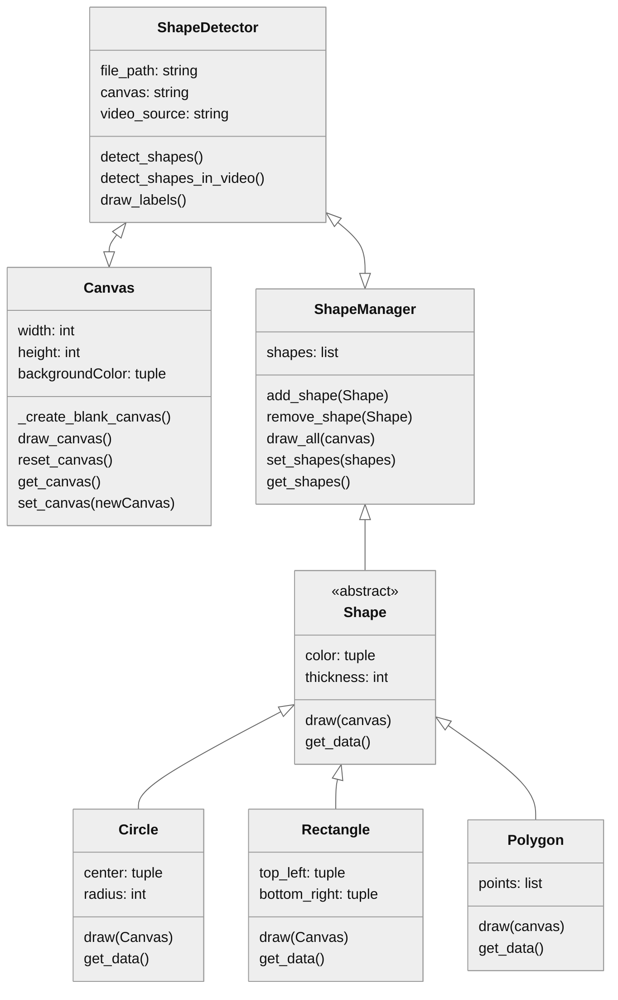

#

```mermaid

    %%{init: {'theme': 'neutral', 'themeVariables': {'primaryColor': '#4CAF50', 'edgeLabelBackground': '#ffffff'}}}%%


    classDiagram
        class Canvas {
            width: int
            height: int
            backgroundColor: tuple
            _create_blank_canvas()
            draw_canvas()
            reset_canvas()
            get_canvas()
            set_canvas(newCanvas)
        }

        class ShapeManager {
            shapes: list
            add_shape(Shape)
            remove_shape(Shape)
            draw_all(canvas)
            set_shapes(shapes)
            get_shapes()
        }

        class Shape {
            <<abstract>>
            color: tuple
            thickness: int
            draw(canvas)
            get_data()
        }

        class Circle {
            center: tuple
            radius: int
            draw(Canvas)
            get_data()
        }

        class Rectangle {
            top_left: tuple
            bottom_right: tuple
            draw(Canvas)
            get_data()
        }

        class Polygon {
            points: list
            draw(canvas)
            get_data()
        }

        class ShapeDetector{
            file_path: string
            canvas: string
            video_source: string
            detect_shapes()
            detect_shapes_in_video()
            draw_labels()
        }

        

        Shape <|-- Circle
        Shape <|-- Rectangle
        Shape <|-- Polygon

        ShapeManager <|-- Shape

        ShapeDetector <|--|> ShapeManager
        ShapeDetector <|--|> Canvas


```
