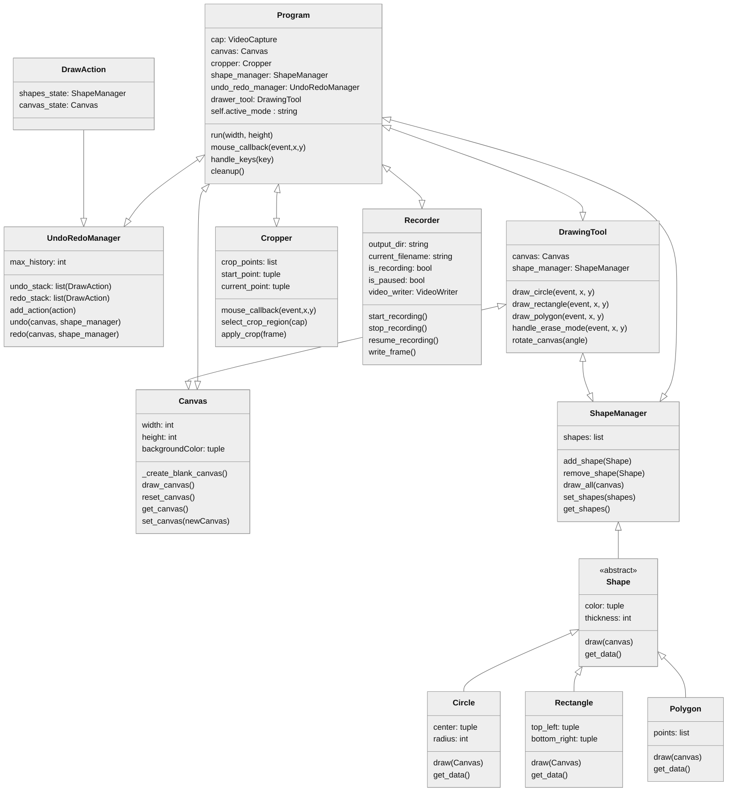

#

```mermaid

    %%{init: {'theme': 'neutral', 'themeVariables': {'primaryColor': '#4CAF50', 'edgeLabelBackground': '#ffffff'}}}%%

    classDiagram
        class Canvas {
            width: int
            height: int
            backgroundColor: tuple
            _create_blank_canvas()
            draw_canvas()
            reset_canvas()
            get_canvas()
            set_canvas(newCanvas)
        }

        class ShapeManager {
            shapes: list
            add_shape(Shape)
            remove_shape(Shape)
            draw_all(canvas)
            set_shapes(shapes)
            get_shapes()
        }

        class Shape {
            <<abstract>>
            color: tuple
            thickness: int
            draw(canvas)
            get_data()
        }

        class Circle {
            center: tuple
            radius: int
            draw(Canvas)
            get_data()
        }

        class Rectangle {
            top_left: tuple
            bottom_right: tuple
            draw(Canvas)
            get_data()
        }

        class Polygon {
            points: list
            draw(canvas)
            get_data()
        }

                class UndoRedoManager {
            undo_stack: list(DrawAction)
            redo_stack: list(DrawAction)
            max_history: int
            add_action(action)
            undo(canvas, shape_manager)
            redo(canvas, shape_manager)
        }

        class DrawAction{
        shapes_state: ShapeManager
        canvas_state: Canvas
        }

        class DrawingTool {
            canvas: Canvas
            shape_manager: ShapeManager
            draw_circle(event, x, y)
            draw_rectangle(event, x, y)
            draw_polygon(event, x, y)
            handle_erase_mode(event, x, y)
            rotate_canvas(angle)
        }

        class Program{
            cap: VideoCapture
            canvas: Canvas
            cropper: Cropper
            shape_manager: ShapeManager
            undo_redo_manager: UndoRedoManager
            drawer_tool: DrawingTool
            self.active_mode : string
            run(width, height)
            mouse_callback(event,x,y)
            handle_keys(key)
            cleanup()
        }

        class Cropper{
            crop_points: list
            start_point: tuple
            current_point: tuple

            mouse_callback(event,x,y)
            select_crop_region(cap)
            apply_crop(frame)
        
        }

        class Recorder{
            output_dir: string
            current_filename: string
            is_recording: bool
            is_paused: bool
            video_writer: VideoWriter
            
            start_recording()
            stop_recording()
            resume_recording()
            write_frame()
        }

        Shape <|-- Circle
        Shape <|-- Rectangle
        Shape <|-- Polygon

        Program <|--|> Canvas
        Program <|--|> ShapeManager
        Program <|--|> DrawingTool
        Program <|--|> UndoRedoManager
        Program <|--|> Cropper
        Program <|--|> Recorder
        DrawAction --|> UndoRedoManager
        DrawingTool <|--|> Canvas
        DrawingTool <|--|> ShapeManager
        ShapeManager <|-- Shape


```
